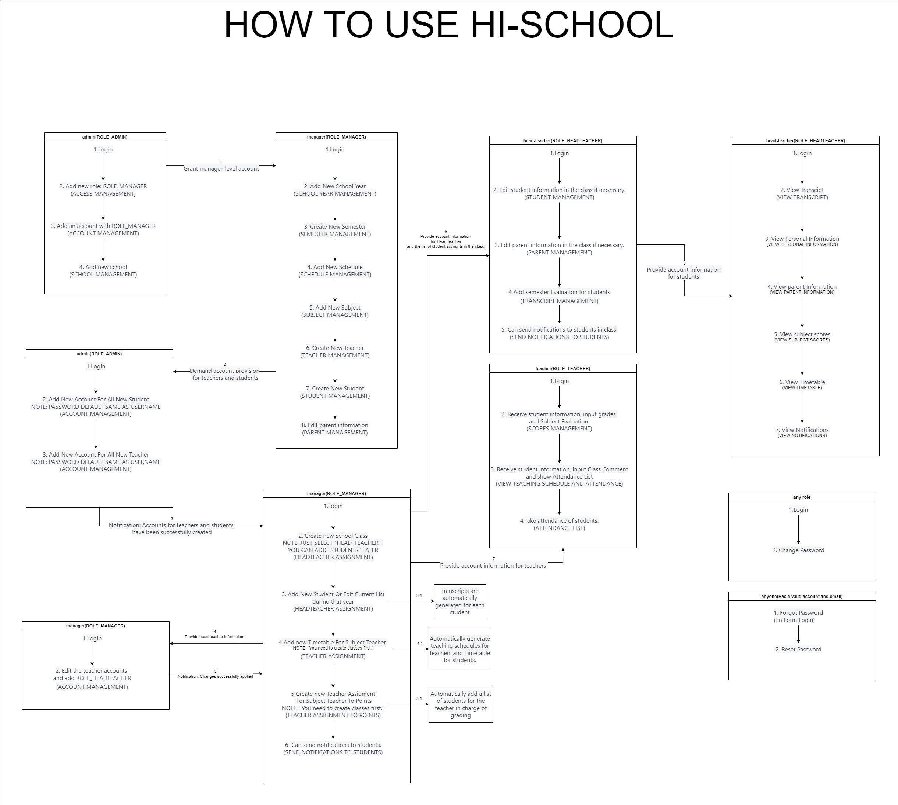
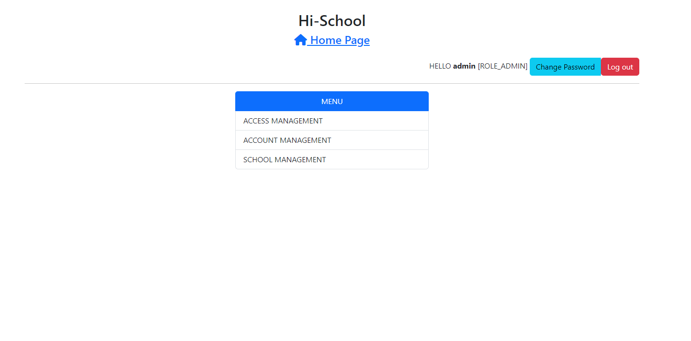
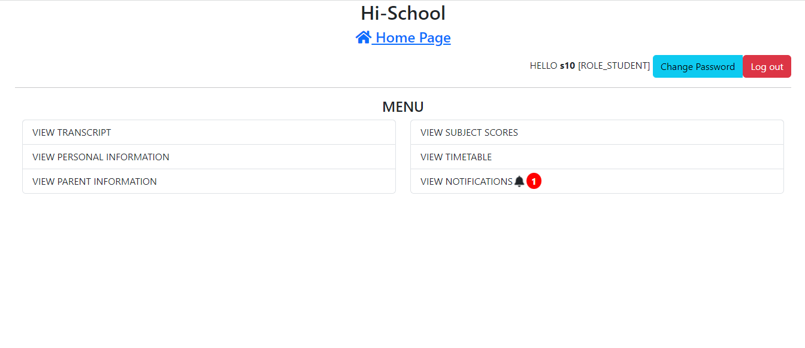

# The Hi-School App🚀

 

## ⭐ Introduction

**Introducing the High School Simulation Project with Spring Boot in the Web Field for Vietnam**

Welcome to the High School Simulation Project, a purely academic and research-focused initiative, aimed at exploring the potential of technology in the context of high school education in Vietnam through web applications. This simplified project, powered by the robust Spring Boot framework, serves as a research tool to understand and uncover the capabilities of technology in enhancing the educational experience within the web domain.

In an era where educational technology is advancing rapidly, our project aims to provide insights and learning opportunities within the web application development for education. While it may not possess the complexity of a complete application, it represents a significant step in the academic journey to explore the creative use of web technology to improve the quality of education.

This introduction marks the beginning of a research-driven journey through the High School Simulation Project in Vietnam within the web application development field. Join us as we explore how web technology can influence and enhance the educational experience in the Vietnamese context.

Welcome to a research-driven vision of the future of high school education in Vietnam in the web development field. Welcome to the High School Simulation Project powered by Spring Boot.
    
    

## ❗ Note

-  Development branch contains the code for the localhost development version.
-  For the first run, execute the code inside the comment block: //Create a default Admin account in the Account Controller.
    
    

## 🔥 Getting Started With The Project

-  Fork the Project in your Repository.
-  Clone the Forked Repository in your Local System.
-  Install & Configure - Xampp, HeidiSQL, IDE IntelliJ.
- Set the Environment Variables in application.properties:
  
  - "DATABASE_NAME"
  - "GMAIL ADDRESS"
  - "PASSWORD APPLICATION OF GMAIL"
-  Run project
-  Enjoy :)

For any issues related to the project, raise an ISSUE in the respective Repository.
 
 

## 🔨 Tools Used

-  Library:
    - bcrypt
    - Spring
    - Thymeleaf
    - MySQL Connector
    - Spring Boot Mail
    - Spring Core
-  Framework: Spring boot
-  Database: MySQL
-  Version Control System: Git
-  Programming / Scripting: JavaScript
-  Front-End: HTML, CSS, Thymeleaf
-  Integrated Development Environment: IntelliJ
    
    

## 🔗 Links

>
> ## Checkout the Application Demo Video [YouTube](https://www.youtube.com/playlist?list=PLmvWP9s5KLJtQl54UVN-0DrJAD642O_ca)

 

## 💻 Screens

 

## 🐦 Follow Me:

> [LinkedIn](https://www.linkedin.com/in/vankieuit/)

I hope you like the project. Thanks for reading :)
